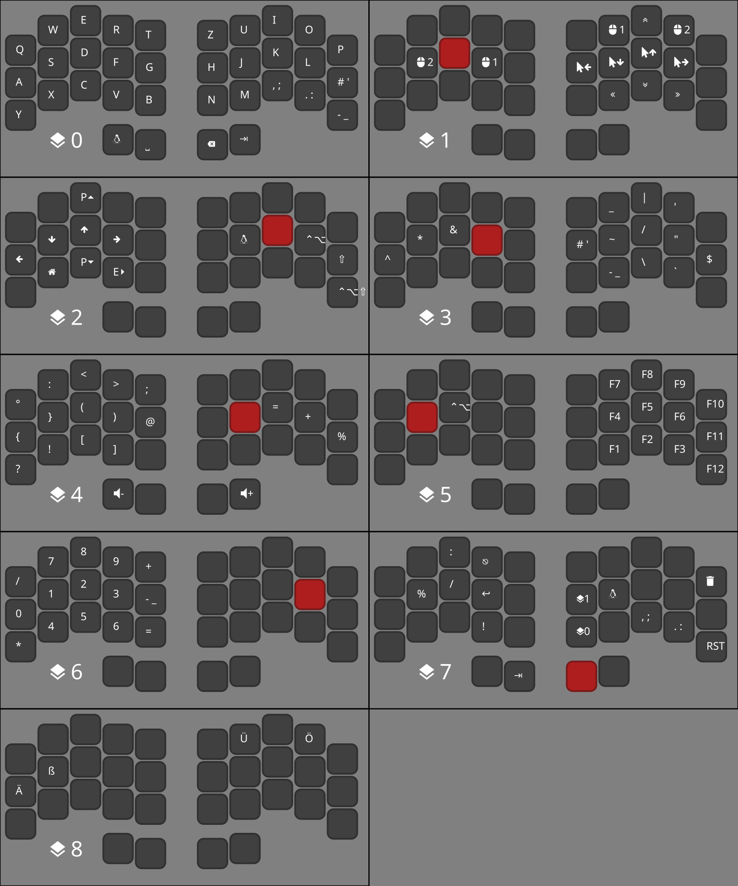

# Ferris Keymap Visualizer

This is my personal program to create a visual representation in the form of an SVG of a [QMK Configurator keymap.json](https://config.qmk.fm/#/ferris/0_1/LAYOUT_split_3x5_2) for the [Ferris Sweep](https://github.com/davidphilipbarr/Sweep/tree/main/Sweepv2.1), a 34 key split ergonomic keyboard. The main reason I created this program was, because the built-in print function from the configurator does not work with German keys.

## Quick start
After cloning the repo and building the binary, you are presented with a CLI tool.

Use `cargo run -- -h` or `fkv -h` for the help page.
When running, you will need to specify the `keymap.json` file which is the source for the information.
Optionally a layer number can be passed; if left out all layers will be generated.

Arguments:
| Argument | Description                                                            | Required |
| ___      | ___                                                                    | ___      |
| <KEYMAP> | The `keymap.json` file which is generated by QMK                       | Required |
| <LAYER>  | The zero based index of the layer. Prints every layer if not specified | Optional |

Options:
| Option             | Description                      |
| ___                | ___                              |
| -h, --help         | Print help information           |
| -i, --image <PATH> | Name of the output file          |
| -V, --version      | Print version information        |

The generated image will be an SVG which can be viewed with many modern image viewers or the browser.
I have used some symbols from a [Nerd Font](https://www.nerdfonts.com/) which you will need, or some boxes will appear.

At the moment all symbols and the color of the layer key which has to be pressed are hard-coded and only the keys I use are parsed.

## Example
The following is an example using my [personal keybindings](https://github.com/Pyxels/qmk_firmware/tree/my-qmk):

## Built with 
- [SVG Crate](https://crates.io/crates/svg)
- [Serde](https://crates.io/crates/serde)
- [Clap](https://crates.io/crates/clap)

